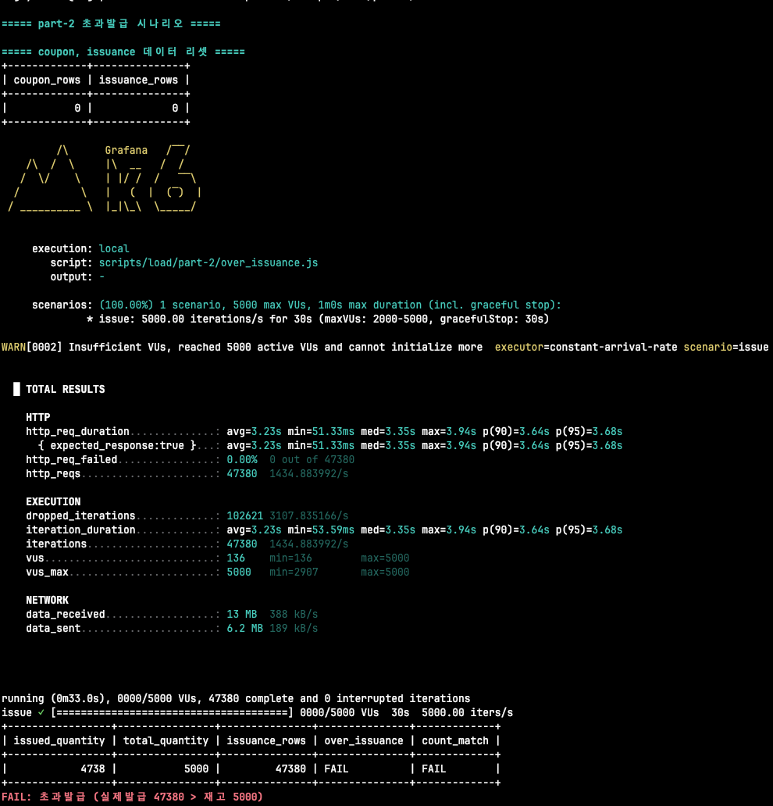
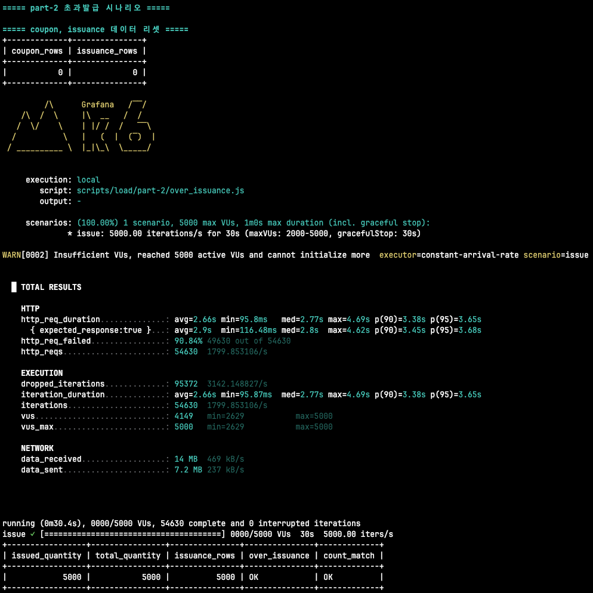
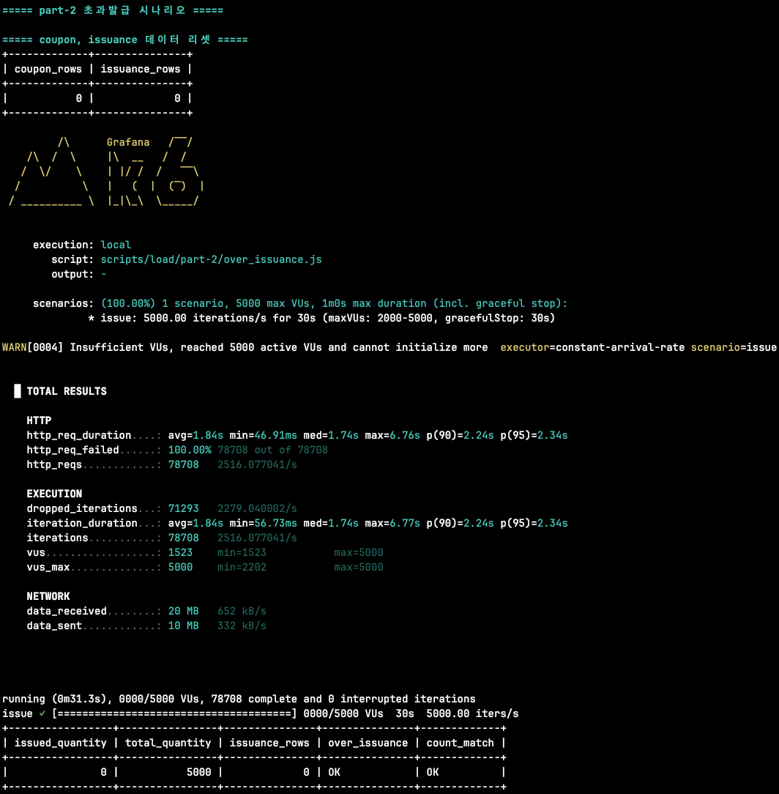
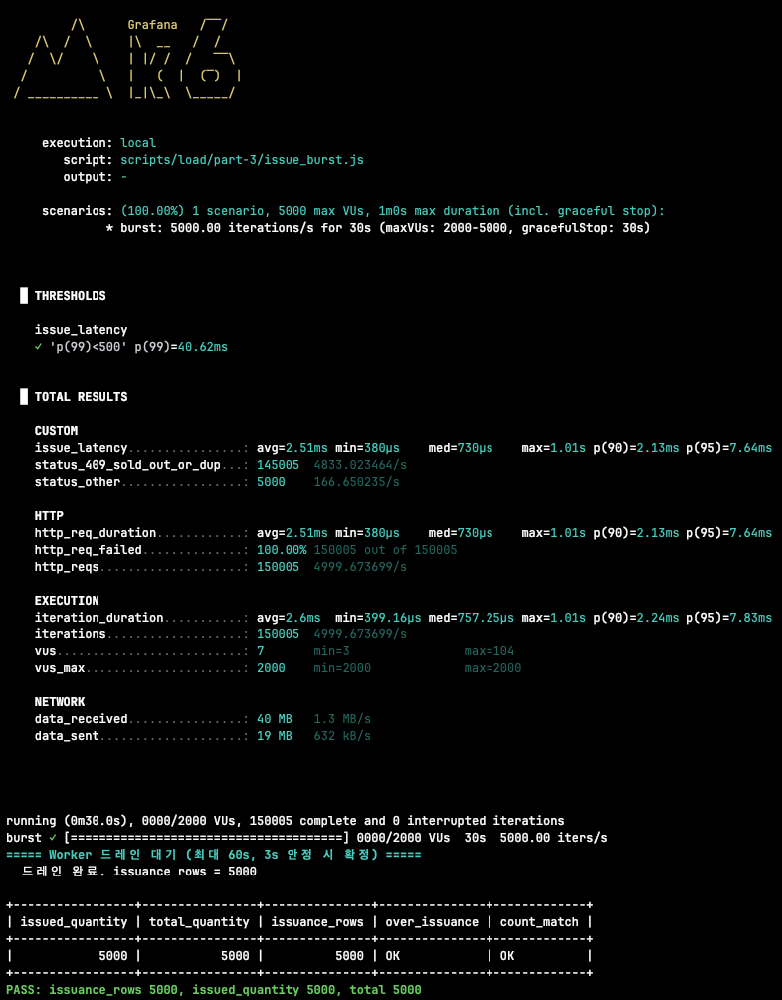
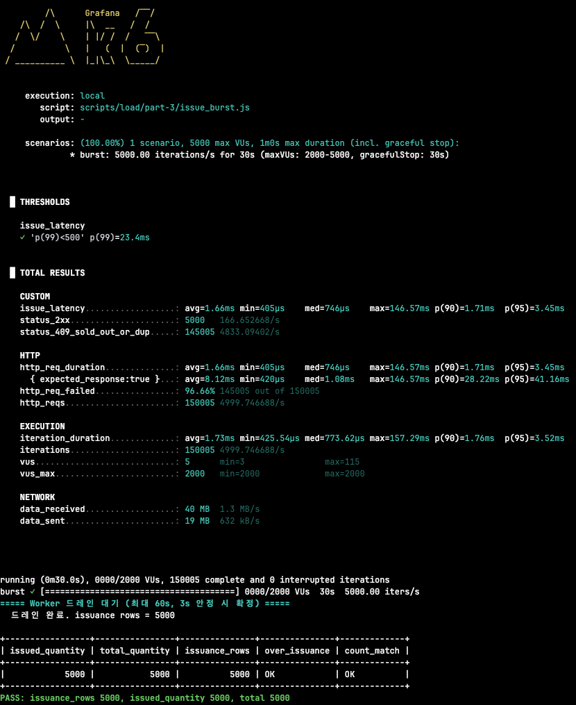

# 부하 테스트

## 사전 준비

- `brew install k6 jq`
- `./gradlew --stop && ./gradlew jibDockerBuild && docker compose up -d` jib 도커 빌드 후 서비스가 8080 응답

### 브랜치 전환 시

브랜치마다 서비스 코드가 다르므로, 전환 후에는 이미지를 새로 생성하여 도커 컨테이너를 재실행한다.

```bash
git checkout <branch>
./gradlew --stop && ./gradlew jibDockerBuild && docker compose up -d
```

## part-2

**파트2에서는 동시성을 고려하지 않은 코드에서부터 부하테스트를 진행하고, 추가 발행을 고려한 코드로 변경해가면서 부하테스트를 진행한다.****


```bash
./scripts/load/part-2/run.sh
```

`run.sh` 는 `reset → create_coupon → k6 → verify` 를 한 번에 실행한다.

### 동기 DB 테스트 결과

**동시성을 고려하지 않은 어플리케이션 코드**



- vUser 5000
- 쿠폰 초과발급
- p95 3.68초

### 비관적락 테스트 결과

**데이터베이스의 행 락(row lock)을 사용하여 동시성을 고려한 어플리케이션 코드**



- vUser 5000
- 쿠폰 초과발급 없음
- p95 3.65초

비관적락을 사용하는 경우 요청이 직렬화되어 순차 처리가 된다.

락의 임계영역만큼 직렬화된 처리 시간이다.

### 레디스 원자연산 (lua script)

레디스의 원자연산을 사용하여 임계영역을 줄여 병렬화된 요청의 처리 시간을 줄였다.



- vUser 5000
- 쿠폰 초과발급 없음
- p95 2.34초

## part-3

파트3에서는 파트2에서 개발한 기능의 성능 개선에 집중한다. 기존 기능은 p95가 2초 이상 소요되어 사용자가 많은 불편을 느낄 수 있다. 

성능을 향상시키기 위해 병목이 되는 부분인 데이터베이스 적재 로직을 메시지큐를 사용해 분리하는 작업을 진행한다.

부하 분산 및 동시성 처리를 공부하는 본 프로젝트 특성상 메시지큐의 설정은 가장 기본적인 형태로 사용한다.

### Linked Blocking Queue를 사용하여 자체 개발 메시지큐

Linked Blocking Queue를 사용하여 InMemory 큐를 생성하여 데이터베이스에 적재하는 부분을 워커 쓰레드에 위임한다.



- vUser 5000
- 쿠폰 초과발급 없음
- p99 40.62ms
- p95 7.64ms

### Spring Event Listener 사용

Linked Blocking Queue를 사용하여 인메모리 큐를 만들었지만, 비슷한 구현체를 이미 스프링에서 제공하고 있다.

스프링 이벤트를 발행하고 비동기로 실행하도록 변경했다.



- vUser 5000
- 쿠폰 초과발급 없음
- p99 23.4ms
- p95 3.45ms

### Kafka 사용
